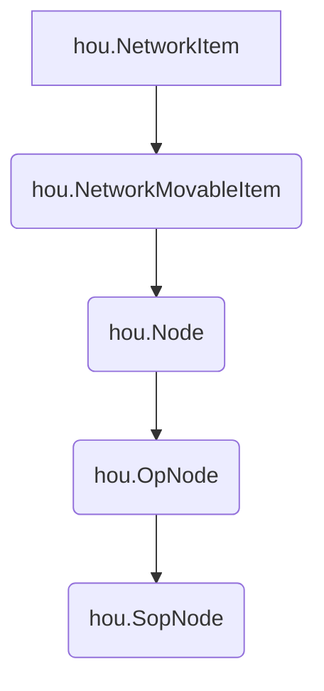

# Extending Houdini

Houdini's Python API is implemented with the `hou` module. Each node is implemented as a class that inherits from a hierarchy of classes. ^3c762b

For example, a `null SOP` is a `hou.SopNode` inheriting from multiple other classes

This means that you can access any methods from the superclasses from the current subclass. However, there are some exceptions to this with regards to PDG and USD contexts.

## Accessing a PDG class with Python

In order to access a `pdg.Node` object, you have to use the `getPDGNode()` method on a `hou.TopNode`

Credits to the following forum post that helped me discover this:
> [!info] pythonscript to press button on node per work item | Forums | SideFX  
> [https://www.sidefx.com/forum/topic/73862/?page=1#post-312290](https://www.sidefx.com/forum/topic/73862/?page=1#post-312290)  

```python
top_node = hou.node('/obj/topnet1/genericgenerator1') #inherits hou.TopNode class
pdg_node = top_node.getPDGNode()                      #inherits pdg.Node class
for work_item in pdg_node.workItems:
    print(work_item)

#    use top_node.getSelectedWorkItem() 
#    and top_node.setSelectedWorkItem(id)
#    to get and set the current work item
#  THIS ONLY WORKS IF THE NODE IS ALREADY COOKED OR ELSE workItems will return NONE
#  WHICH YOU CAN COOK USING top_node.cookWorkitems() method
```

## Accessing a USD class with Python

To access a `pxr.Usd.Stage` object and use the USD functions in Houdini, you have to call the `stage()` method on a `hou.LopNode`. 

>[!info] Nvidia Python USD API Documentation
>[https://docs.omniverse.nvidia.com/kit/docs/pxr-usd-api/latest/pxr/Usd.html#pxr.Usd.Stage](https://docs.omniverse.nvidia.com/kit/docs/pxr-usd-api/latest/pxr/Usd.html#pxr.Usd.Stage)

>[!attention] Important
>Take note, not all nodes that you create within Solaris is `hou.LopNode`, for example, the USD Render ROP which is unique to Solaris, does not inherit from `hou.LopNode`.

### Example Code to get a Usd.Prim and attribute

```python
node = hou.pwd()
stage = node.stage()
#Now that we have a pxr.Usd.Stage object
#We can start calling methods from the Usd-API

usdPrim = stage.getPrimAtPath("/geo")
usdAttribute = usdPrim.GetAttribute("example")
value= usdAttribute.Get()

```
---
## Incremental Save

So Houdini has an incremental save feature but with the default customization you can only choose to either go with incremental saves or to overwrite your saves as the only behavior. If you want to have a selectable option for incremental and overwriting your saves, you have to create a script. Luckily its only two lines.

```python
import hou #not needed but I like to include it
hou.hipFile.saveAndIncrementFileName()
```

Save this script and add it to your File menu using the following method and you are set.
### Adding a Script to Houdini’s built-in main menus

You can control any menu element in Houdini from the xml configuration files located in your Houdini installation’s folder, official documentation [here](https://www.sidefx.com/docs/houdini/basics/config_menus.html).

But the summary is, after you create your script add this to your MainMenuCommon.xml

```xml
<mainMenu>
  <addScriptItem id="h.saveinc">
	 <parent>file_menu</parent>
	 <label>Save Incrmental</label>
	 <scriptPath>$Pipelinetools/scripts/saveIncremental.py</scriptPath>
	 <scriptArgs></scriptArgs>
	<insertAfter>h.save</insertAfter>
  </addScriptItem>
</mainMenu>
```

![[images/extending-menu-example.png]]

`<parent>` tag indicates which menu the new item will live under

`<insertAfter>` indicates the placement of of the additional item using the id of the element to insert after

The ids and parent menu names can be found under _$HH/MainMenuCommon.xml or $HFS/houdini/MainMenuCommon.xml_

## Collect Files (How to package a project)

So, I was making my own script for packaging a project using Python as an excuse to try out and learn Python within Houdini, but I also found out that there’s a script made by Aeoll that already accomplishes what I wanted to make, and also included features that I did not think to include, so [here it is](https://github.com/Aeoll/HipCollector/tree/master).

Regardless, here’s the code that I had typed that will serve as reference for me on how to find specific node types:

```python
import hou
#returns all instances of nodes of type 'file'
#use hou.node('path-to-node').type() to return
#the type of a specific node you need
fileN = hou.sopNodeTypeCategory().nodeType('file').instances()
for node in fileN:
		#evalParm evaluates the current value of the selected parm
		#this means that $F or any expressions will return as the
		#current value, eg. on frame 86 $F will return 86
    path = node.evalParm('file')
    print(path.replace('$HIP',''))
```

This script will print out all directories from the ‘file’ parameter on all file nodes in the Houdini project.